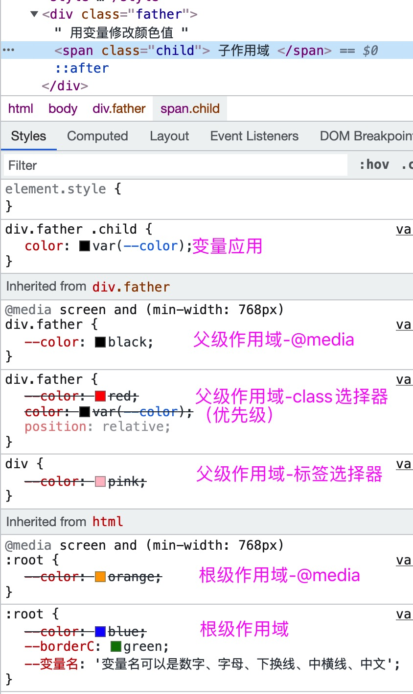

# var 变量

### 小知识点

变量声明： `--color`  
变量命名：变量名可以是数字、字母、下换线、中横线、中文  
变量赋值：`--color: red; --color1: #def;`  
变量获取：`color: var(--color);`  
默认值：`var(变量名, 可选的默认值1, 可选的默认值2...)`，如果引用的变量没有定义，则按默认值的顺序依次取默认值进行使用。默认值比较适合`calc`计算时，万一计算结果非法，可以用默认值。  
变量取值：颜色值、字符串、多个值的组合、函数等。注意，**带单位**的值和**颜色值**不用加引号包成字符串，示例：`--borderC: green;--fontSize: 12px;`
变量值不合法：使用默认值。比如`var(--color, red);`中，--color 值如果非法，不会使用 red，而是使用样式表中继承的/默认的样式值来代替  
权重层级：遵循 css 选择器的权重等级，比如：`内联样式 > id > class > 标签 > *`

### 作用域：

如下几条规则

1. 放在 `:root` 根选择器的变量，所有选择器里都能用；
2. 放在私有选择器的只能自己及下级使用。类似函数作用域的规律。
3. 结合 `sass`、`less` 等预处理器的选择器嵌套功能使用时，父作用域的变量子作用域也可以用。
4. 结合`@media`实现响应式变化不同作用域的变量值

```html
<style>
  :root {
    /* 全局作用域的变量 */
    --color: blue;
    --borderC: green;
    --变量名: '变量名可以是数字、字母、下换线、中横线、中文';
  }

  div {
    --color: pink;
  }

  div.father {
    /* 私有作用域 */
    --color: red;
    color: var(--color);
    position: relative;
    transition: color 0.3s ease-in-out;
  }

  div.father::after {
    content: var(--变量名);
    color: var(--color);
    border: 1px solid var(--borderC);
    transition: color 0.3s ease-in-out;
  }

  div.father .child {
    --color: rgb(255, 60, 190);
    color: var(--color);
  }

  /* 结合`@media`实现响应式变化不同作用域的变量值 */
  @media screen and (min-width: 768px) {
    :root {
      --color: orange;
    }

    div.father {
      --color: black;
    }
  }

  /* 兼容性判断 - css */
  @supports ((--color: 0)) {
    div.father::before {
      content: '当前浏览器支持css variables';
      color: red;
      border: 3px lodash var(--borderC);
    }
  }

  @supports (not (--color: 0)) {
    div.father::before {
      content: '不支持';
      color: var(--color);
      border: 3px lodash var(--borderC);
    }
  }
</style>
<div class="father" id="father">
  用变量修改颜色值
  <span class="child"> 子作用域 </span>
</div>
<button id="getBtn">获取css var变量值</button>
<button id="setBtn">设置css var变量值</button>
<button id="deleteBtn">删除css var变量值</button>
```



### 兼容性

各浏览器兼容情况：https://caniuse.com/?search=css%20var

兼容性判断

```CSS
/* 兼容性判断 - css */
@supports ((--color: 0)) {
  div.father::before {
    content: '当前浏览器支持css variables';
  }
}

@supports (not (--color: 0)) {
  div.father::before {
    content: '不支持';
  }
}
```

```JS
(() => {
  console.log('当前页面是否支持Css变量', window.CSS.supports('--color', 0))
})()
```

### JS 操作 CSS 变量

```JS
var root = getComputedStyle(document.documentElement);
var divFather = getComputedStyle(father);
console.log(root, divFather)
//  读取 变量值
getBtn.onclick = () => {
  var var1 = root.getPropertyValue('--color').trim();
  console.log(var1);
}
// 新增 / 修改变量值
setBtn.onclick = () => {
  father.style.setProperty('--color', '#111def');
  var var2 = divFather.getPropertyValue('--color').trim();
  console.log(var2);
}
// 删除 变量值
deleteBtn.onclick = () => {
  father.style.removeProperty('--color');
  var var3 = divFather.getPropertyValue('--color').trim();
  console.log(var3);
}
```

### 优势
- 带作用域、能继承、能组合calc、@media等特性使用
- 实时计算、运行时、动态
- 可交互（配合js）（如果利用表单value值的变化，其实纯css+选择器权重也可以达到效果。备注1）
- 可配合预处理器使用（sass、less等）

备注1：只是一个想法，类似css实现美化版的checkbox的思路。一个文本框里输入颜色值，然后设置更高级的选择器的变量为输入的颜色值，根据作用域及选择器优先级从而达到变量取值修改、颜色动态变换的效果。

### 劣势
- 低版本浏览器兼容性考虑