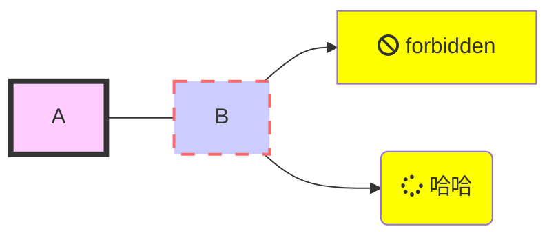
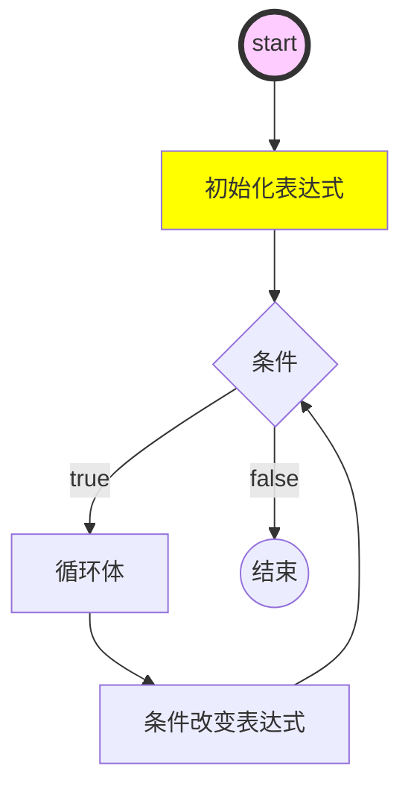

```mermaid
graph LR
  A --- B
  B-->C[fa:fa-ban forbidden]
  B-->D(fa:fa-spinner 哈哈);
  style A fill:#f9f,stroke:#333,stroke-width:4px,fill-opacity:0.5
  style B fill:#ccf,stroke:#f66,stroke-width:2px,stroke-dasharray: 10,5
  classDef default fill:yellow
```

```mermaid
graph TD
  st((start)) --> 初始化表达式
  初始化表达式 --> 条件{条件}
  条件 --true--> 循环体
  循环体 --> 条件改变表达式
  条件改变表达式 --> 条件
  条件 --false--> ed((结束))
  style st fill:#f9f,stroke:#333,stroke-width:4px,fill-opacity:0.5
  style 初始化表达式 fill:yellow
```