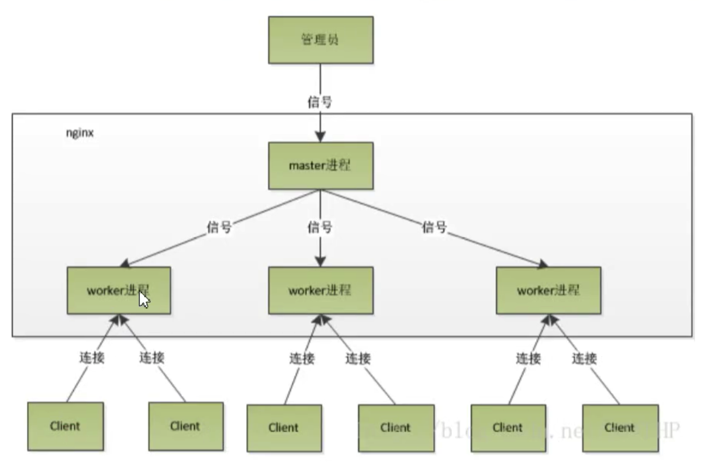

Nginx应用场景：

静态资源服务器（如js、css等，虽然node也可以做到，但是性能差） 
反向代理服务【负载均衡】请求到达nginx，再代理到目标服务器
API接口服务（LUA&JS）【脚本编程、权限控制、缓存设置】请求nginx后，访问系统服务器或者直接访问数据库（缓存设置：结合MemCache或者Redis）

优势：

高并发、高性能（比Apache并发高几十倍）
可扩展性好（内核小，功能通过模块扩展实现）
高可靠性（出问题情况少）
热部署（类似前端热更新，更新后不用重新启动）【王者荣耀服务器更新，已进入系统的用户不受影响？】
开源许可

