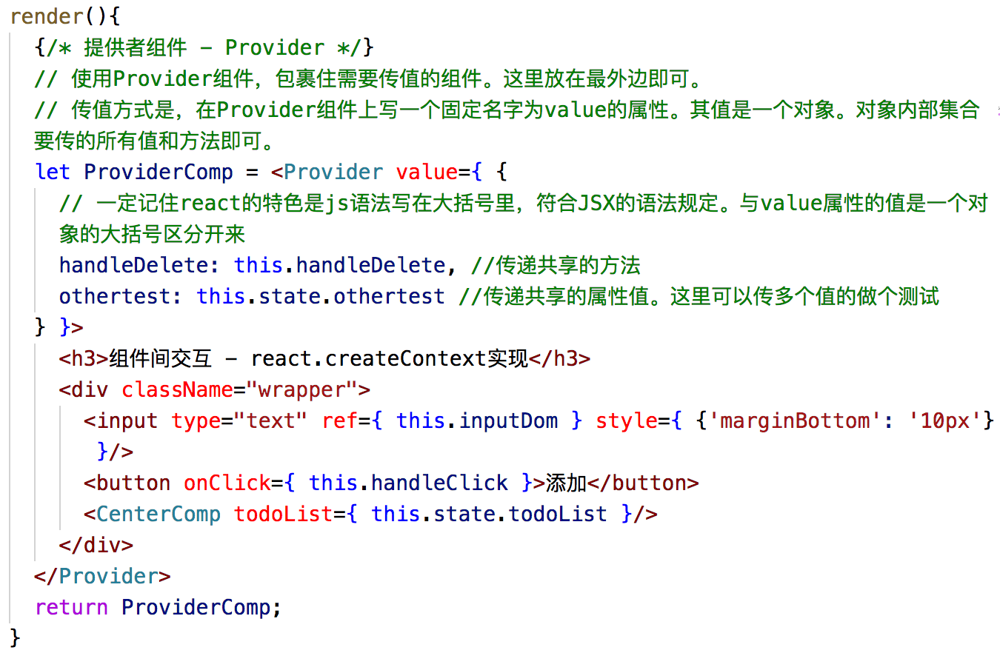
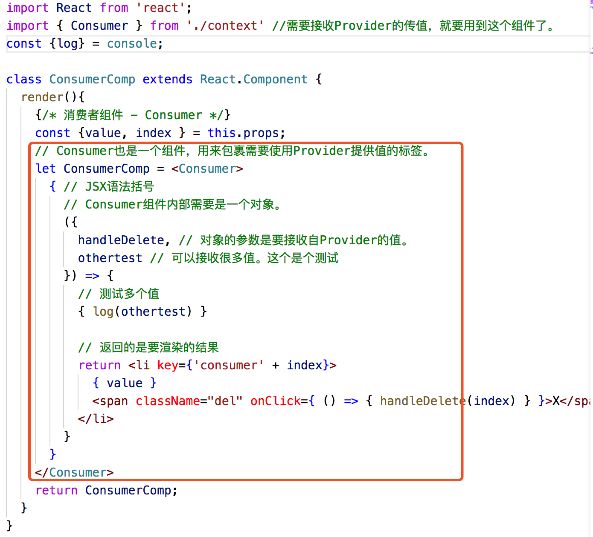

## 组件间交互 - 爷孙组件层级传递
### 目录：
```
1. 父组件引入子组件并通过属性传值  

2. 孙子组件修改爷爷组件源值  
  
  方案二：React.createContext

    i. 需要V16+

    ii. Provider组件 - 提供者（方案一的爷爷组件）
    
    iii. Consumer组件 - 消费者（使用者，方案一的孙子组件）
```


**以todoList进行组件拆分，实现父子组件**

* TodoWrapper - 外层最大的组件

* TodoList - 最外边红框、列表组件

* TodoItem - 一条一条的item数据

### 父组件引入子组件并通过属性传值：

子孙们需要啥属性，就一股脑的往组件身上绑定就行了。要啥给啥、无私奉献。

爷爷传参数给爸爸、爸爸再传参数给孙子。一层一层父到子的数据传递。 


### 本节重点：孙子组件删除爷爷组件内部的数据
（功能目标：在TodoItem中删除TodoList中对应的、位于TodoWrapper中的数据）


方案一详见[这里](../family/README.md)

#### 实现方案二：React.createContext （ps：react16+）

1 . 提供者组件（方案一的爷爷组件）提供一个Provider 

&nbsp;&nbsp;&nbsp;&nbsp;a. 谁需要提供数据，谁就在最外层套一个provider的组件。  
&nbsp;&nbsp;&nbsp;&nbsp;b. Provider组件上有个value属性（value的名字是固定的）其值为一个对象。对象内集合所有需要传递的值。

  
2 . 消费者组件（方案一的孙子组件）利用Consumer接收数据并拿过来用  
&nbsp;&nbsp;&nbsp;&nbsp;a. 谁需要消费数据，谁就在外边套一个组件。（注：Consumer组件内部是一个函数、函数参数是一个对象，且该函数返回要渲染的结果）

核心代码：
Provider


Consumer



