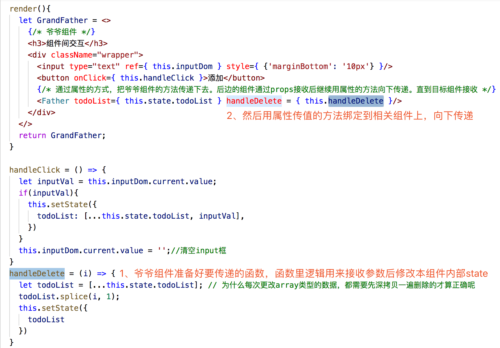
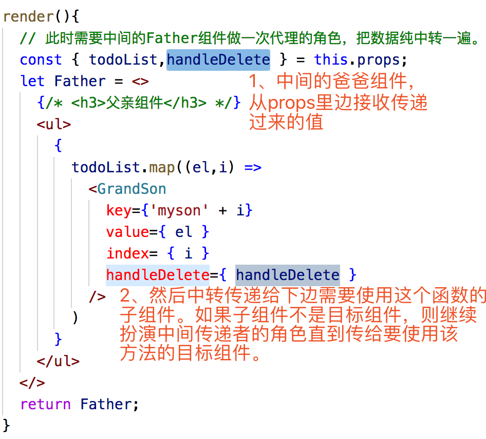

## 组件间交互 - Provider和Consumer
### 目录：
```
1. 父组件引入子组件并通过属性传值  

2. 孙子组件修改爷爷组件源值  

  方案一：大型家庭伦理继承剧

    i. 爷爷组件定义好修改值的功能函数

    ii. 爸爸组件接收函数并传递给下边的儿子

    iii. 末尾要使用的子孙组件调用方法修改爷爷组件值

  方案二：React.createContext

    i. 需要V16+

    ii. Provider组件 - 提供者（方案一的爷爷组件）
    
    iii. Consumer组件 - 消费者（使用者，方案一的孙子组件）
```


**以todoList进行组件拆分，实现父子组件**

* TodoWrapper - 外层最大的组件

* TodoList - 最外边红框、列表组件

* TodoItem - 一条一条的item数据

### 父组件引入子组件并通过属性传值：

子孙们需要啥属性，就一股脑的往组件身上绑定就行了。要啥给啥、无私奉献。

爷爷传参数给爸爸、爸爸再传参数给孙子。一层一层父到子的数据传递。 


### 本节重点：孙子组件删除爷爷组件内部的数据
（功能目标：在TodoItem中删除TodoList中对应的、位于TodoWrapper中的数据）

#### 实现方案一：大型家庭继承剧
1. 爷爷组件定义好修改值的功能函数  

2. 爸爸组件接收函数并传递给下边的儿子  

3. 末尾要使用的子孙组件调用方法修改爷爷组件值  


#### 实现方案二：React.createContext （ps：react16+）
```
1. 提供者组件（方案一的爷爷组件）提供一个Provider 

  a. 注：组件中value的名字是固定的，值为一个对象
  
2. 消费者组件（方案一的孙子组件）利用Consumer接收数据并拿过来用

  a. 组件内部是一个函数
  
  b. 函数返回要渲染的结果
```

实现方案二详见[这里](../createContext/README.md)


