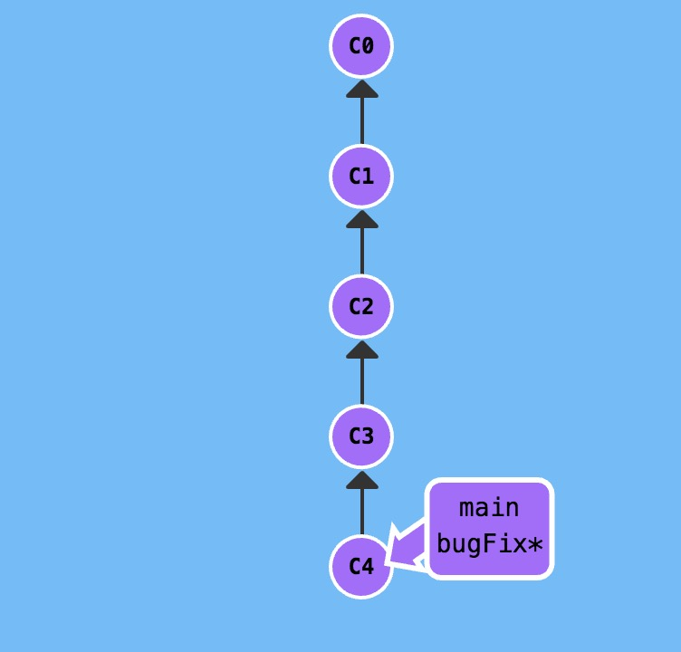
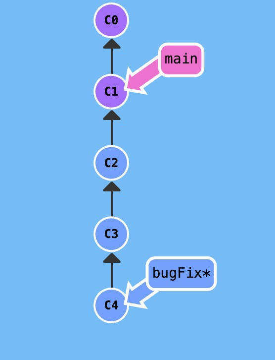

# HEAD
HEAD 指向：`cat .git/HEAD`
如果 HEAD 指向的是一个引用，还可以用 `git symbolic-ref HEAD` 查看它的指向。

[先分离、再移动]
## 分离的 HEAD
分离 HEAD 就是让其指向了某个具体的提交记录而不是分支名。

分离：`git checkout commit记录/哈希值` 

从 bugFix 分支中分离出 HEAD 并让其指向一个提交记录。

通过提交记录上的哈希值（标签）指定提交记录。每个提交记录的哈希值显示在代表提交记录的圆圈中。(在练习里，可视化树里边的哈希值是美化过的。真是的哈希值基于SHA-1，共 40 位)

用 `git log` 来查查看提交记录的哈希值。
## 相对引用HEAD
不用哈希值，走相对步数。

使用相对引用的话，你就可以从一个易于记忆的地方（比如 bugFix 分支或 HEAD）开始计算。

两个简单的用法：
使用 `^` 向上移动 `1` 个提交记录
使用 `~<num>` 向上移动多个提交记录，如 `~3`

### 操作符 (^)。
把这个符号加在引用名称的后面，表示让 Git 寻找指定提交记录的父提交。

所以 main^ 相当于“main 的父节点”。
main^^ 是 main 的第二个父节点
现在咱们切换到 main 的父节点`git checkout main^`

### “~”操作符
如果你想在提交树中向上移动很多步的话，在该操作符后面可以跟一个数字（可选，不跟数字时与 ^ 相同，向上移动一次），指定向上移动多少次。
`git checkout HEAD~4`

## 强制修改分支位置
我使用相对引用最多的就是移动分支。可以直接使用 -f 选项让分支指向另一个提交。例如:

`git branch -f main HEAD~3`

上面的命令会将 main 分支强制指向 HEAD 的第 3 级父提交。

$ git branch -f main c6
$ git branch -f bugFix c0
$ git checkout HEAD~