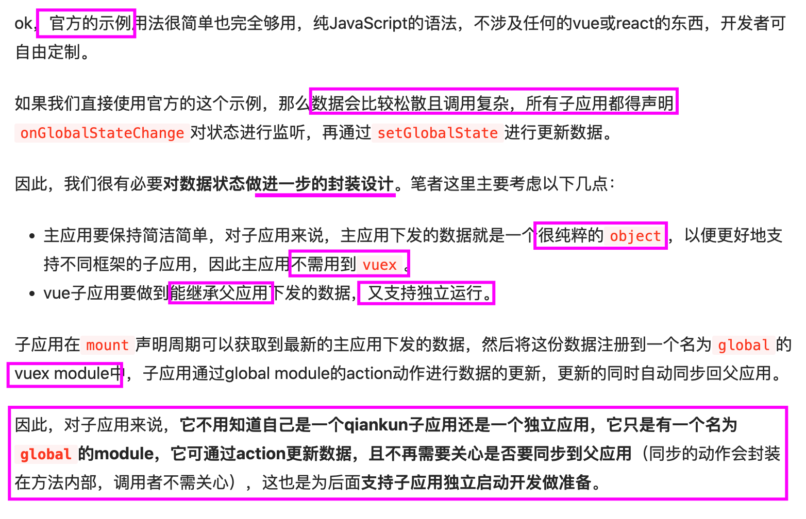

# 微前端概念

## 基座
导航渲染、登录态下发、挂载容器

简洁，不涉及业务操作

## 子应用
配置项：`devServer`端口修改,跨域`headers`和`output`配置  
不同项目详情见：https://qiankun.umijs.org/zh/guide/tutorial

### 独立开发
基座不启动，子应用独立开发，怎么脱离基座的数据独自启动？怎么维护登陆态？

## 数据通信设计
